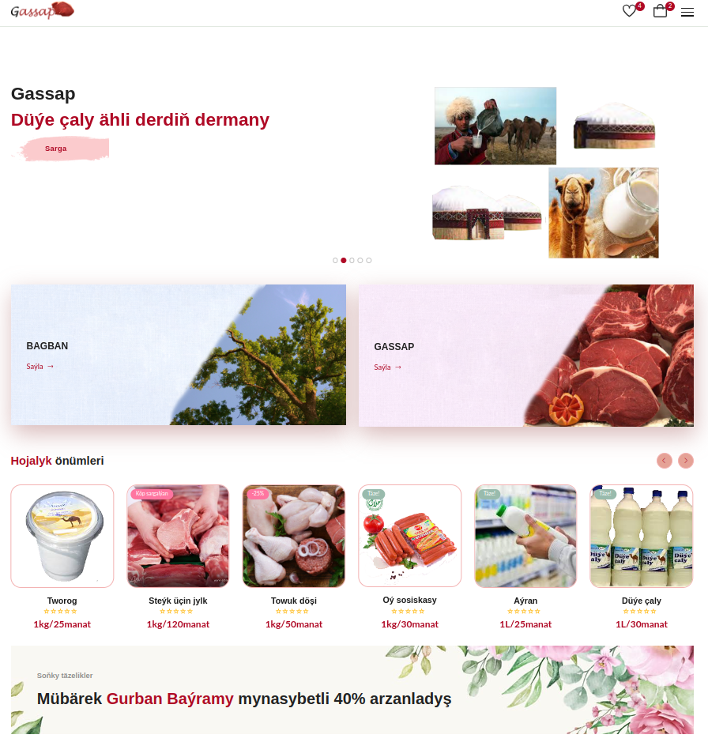
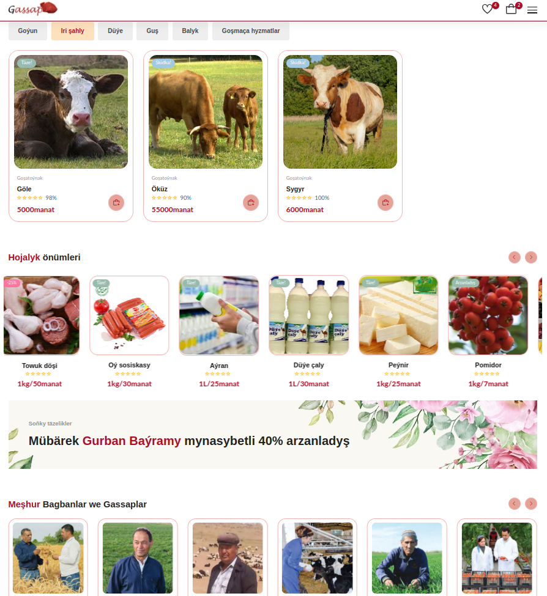

# 🌿 Gassap UI Inspiration

> **Concept only** — A brainstormed e-commerce idea for plants and domestic animals, built upon the **Evara** open-source template.

---

## 📖 Overview
This project is a **front-end UI concept** for an online store that sells domestic animals and plants, with ordering features.  
It was built and presented at the **Sanly Çözgüt 2023** Digital Innovation competition by **Turkmentel**.

---

## 🖼 Screenshots

## 🛠 Built With
- **HTML**
- **CSS**
- **JavaScript**

---

## Notes
This is **only a UI/UX concept** — no back-end or database functionality is implemented.  
The goal was to explore design ideas for a niche online store and present them visually.
